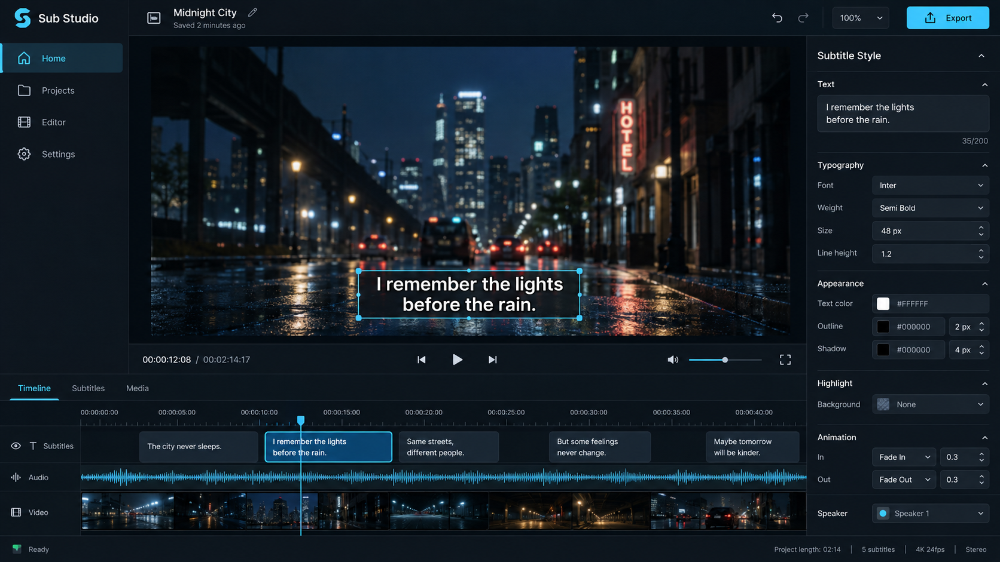
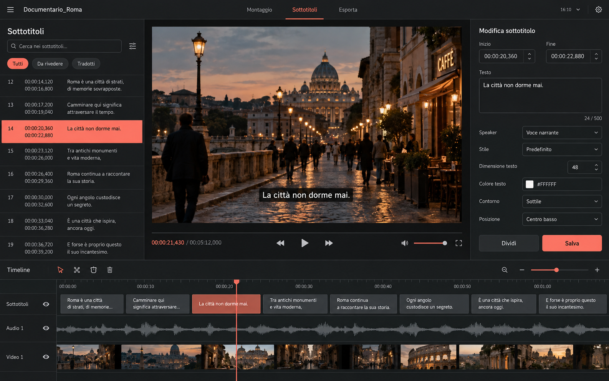

# SubStudio

A macOS-focused subtitle and video processing tool for creating styled subtitles for vertical 9:16 video content.

<p align="center">
  
</p>

SubStudio combines automatic speech transcription, subtitle chunking, visual subtitle rendering, video preview and final video export in a single local workflow.

The project provides both a command-line interface and a local Web UI.


---

## Features

- Automatic speech transcription with `faster-whisper`
- Italian transcription by default
- Configurable transcription language
- Support for multiple Whisper model sizes
- Automatic word grouping and subtitle chunking
- Keyword highlighting
- Styled subtitle rendering
- Multiple subtitle presets
- Custom font support
- Watermark rendering
- Local Web UI
- Video upload and preview
- Synchronized video playback
- Subtitle correction workflow
- Audio waveform visualization
- Batch video processing from the CLI
- Apple Silicon hardware-accelerated video encoding
- Software encoding fallback through `libx264`
- macOS application and DMG build scripts

---

## How It Works

The main processing pipeline is:

```text
Video
  │
  ▼
Audio extraction
  │
  ▼
Speech transcription
  │
  ▼
Word grouping / chunking
  │
  ▼
Subtitle rendering
  │
  ▼
Video burn-in
  │
  ▼
Final subtitled video
```

The CLI pipeline uses:

- `faster-whisper` for speech transcription
- Pillow for subtitle image rendering
- FFmpeg for video processing and final rendering

---

## User Interface

<p align="center">
  
</p>

SubStudio includes a powerful local Web UI structured into a **3-column desktop layout**:

- **Header**: Brand identity, active video status, Silence Removal (`silencedetect`), Theme switcher, Export quality, and Final Video generation.
- **Left Column (Preview & Player)**: 9:16 vertical video player, play/pause controls, seekbar, timecode, and full-screen preview.
- **Center Column (Subtitles Editor)**: Chunk counter, transcription status, inline subtitle & word timing editor, chunk splitting/merging, and translation.
- **Right Column (Inspector & Style)**: Live preset manager, typography options (normal & keyword font families, weights, colors, tracking), coordinate sliders, and watermark controls.
- **Bottom Full-Width Area (Timeline)**: Audio waveform peaks, zoom controls, fit-to-view, interactive subtitle time blocks with CapCut-style transform Gizmo and snapping guides.

The Web UI runs locally on your Mac with zero cloud dependencies.

---

## Subtitle Presets

The project includes several predefined subtitle styles:

### La Voce del Successo New

The official default preset:
- Primary typography: Raleway Light with Raleway Bold keyword accents
- CapCut calibrated coordinate ratios and font scaling
- Proportional watermark support

### MC

A preset using the Alata font without watermark.

Presets are stored in:

```text
presets.json
```

---

## Project Structure

```text
substudio/
│
├── main.py                     # CLI pipeline
├── web_app.py                  # Local HTTP backend & API
│
├── font_manager.py             # Typography library (39+ fonts, variants, caching & metrics)
├── transcriber.py              # faster-whisper transcription & intelligent DP layout resegmentation
├── silence_remover.py          # FFmpeg silence detection & timeline compaction
├── translator.py               # Subtitle translation (Gemini API & Web)
├── audio_extractor.py          # Audio extraction to 16kHz WAV
├── keyword_selector.py         # Keyword & emphasis identification
├── subtitle_renderer.py        # Pillow-based 9:16 subtitle rendering & CapCut calibration
├── ass_generator.py            # ASS subtitle generator
├── video_renderer.py           # FFmpeg video overlay burn-in
│
├── presets.json                # Predefined & custom subtitle styling presets
├── requirements.txt            # Python dependencies
│
├── web_static/
│   ├── index.html              # 3-column Studio interface (Single Page App)
│   └── vendor/
│       └── tailwindcss.js      # Offline Tailwind bundle for standalone macOS app
│
├── fonts/
│   ├── Alata-Regular.ttf
│   ├── Raleway-Light.ttf
│   ├── Raleway-SemiBold.ttf
│   ├── Raleway-Bold.ttf
│   └── google/                 # On-demand offline cache for Google Fonts
│
├── tests/
│   ├── test_layout_segmentation.py  # 14 automated tests for DP layout segmentation & API
│   └── test_typography.py           # Verification of 39 fonts, variants and Pillow rendering
│
├── build_dmg.sh                # Unified, fast Apple Silicon DMG installer builder
├── launcher.m                  # Native Cocoa/WebKit app launcher
│
├── tools/                      # Utilities & icon generators
│   └── create_icon.py          # App icon generator (icns, png, favicon)
│
├── AppIcon.icns
├── AppIcon.png
└── LICENSE
```

---

## Typography & Font Management System

SubStudio includes a comprehensive typography engine managed by `font_manager.py`:

- **Complete Font Catalog (39+ Families)**:
  - **macOS System Fonts**: `Arial`, `Helvetica`, `Helvetica Neue` (mapped to local system fonts and `.ttc` collection indices).
  - **Bundled Core Fonts**: `Raleway`, `Alata`.
  - **Google Fonts (34+)**: `Inter`, `Roboto`, `Open Sans`, `Lato`, `Montserrat`, `Poppins`, `Nunito`, `Nunito Sans`, `Oswald`, `Bebas Neue`, `Anton`, `Roboto Condensed`, `Roboto Slab`, `Merriweather`, `Playfair Display`, `DM Sans`, `Manrope`, `Outfit`, `Plus Jakarta Sans`, `Space Grotesk`, `Barlow`, `Barlow Condensed`, `Fira Sans`, `Source Sans 3`, `Ubuntu`, `Work Sans`, `Archivo`, `IBM Plex Sans`, `IBM Plex Serif`, `Libre Baskerville`, `Cormorant Garamond`, `Cinzel`, `Pacifico`, `Lobster`.
- **Dynamic Variant Resolution**: Real variant mapping for each family (e.g. `Montserrat` supports 10 variants from Thin to Black & Italic; `Bebas Neue` only Regular; `Oswald` from ExtraLight to Bold).
- **Custom Font Uploads**: Drag-and-drop or upload custom `.ttf`/`.otf` files via `/api/upload_font`.
- **Offline Caching**: Automatically downloads and caches requested fonts in `fonts/google/` for zero-latency offline rendering.
- **Dynamic Font Metrics**: FreeType/Pillow typographical metrics computed via `GET /api/font_metrics` for pixel-perfect vertical alignment and CapCut parity.

---

## Intelligent Subtitle Layout & Dynamic Segmentation

The subtitle segmentation engine in `transcriber.py` and `web_static/index.html` uses **Dynamic Programming (DP)** and multi-criteria scoring to partition transcription into optimal subtitle chunks:

- **Strict Fixed-Word Mode ($W_{min} == W_{max}$)**:
  When minimum and maximum words per line are equal (e.g. Min: 2, Max: 2, Lines: 1), phrases are divided strictly into blocks of exact size (with remainder only on the final chunk), perfect for fast-paced viral reels and shorts.
- **Multi-Criteria Optimization ($W_{min} < W_{max}$)**:
  - **Terminal Punctuation (`.`, `?`, `!`):** High-priority bonus (`+120`) to favor natural sentence endings.
  - **Clause Punctuation (`,`, `;`, `:`, `—`):** Clause-break bonus (`+65`) to split coordinate and subordinate clauses naturally.
  - **Speech Silence / Acoustic Gaps:** Uses word-level timestamps from Whisper to award up to `+100` points for speech pauses, naturally aligning subtitle cuts with speaker breathing.
  - **Anti-Dangling Syntactic Rules (`-80`):** Severely penalizes cuts that leave weak grammatical particles dangling at the end of a line (Italian articles `il`, `la`, `un`, prepositions `di`, `a`, `da`, `in`, `con`, `su`, `per`, `tra`, `fra`, `del`, `al`, and conjunctions `e`, `o`, `ma`, `se`, `perché`, `che`).
  - **Reading Cadence:** Smooths line length within $[W_{min} \times L, W_{max} \times L]$ for maximum legibility.
- **Client-Server Parity**: The exact same algorithm is implemented in Python and JavaScript, guaranteeing 100% fidelity between the live interactive timeline preview and the final exported MP4 video.
- **Automated Validation**: Covered by 14 automated unit tests in `tests/test_layout_segmentation.py`.

---

## Web UI Development & Lovable Integration

When customizing or redesigning the frontend with tools like **Lovable**:

1. **Keep Backend Intact**: The Python backend (`web_app.py`) and processing engines (`transcriber.py`, `silence_remover.py`, `subtitle_renderer.py`, `video_renderer.py`, `font_manager.py`) manage speech recognition and FFmpeg encoding. Do not replace or modify them unless changing core processing logic.
2. **Preserve API Contracts**: All interactive frontend features communicate via pure JSON REST endpoints:
   - `GET /api/presets`, `GET /api/preset?id=<id>`, `POST /api/presets`, `POST /api/delete_preset`, `POST /api/duplicate_preset`
   - `GET /api/default_video`, `POST /api/upload`
   - `POST /api/transcribe`, `POST /api/translate_chunks`, `POST /api/analyze_silences`, `POST /api/resegment`
   - `POST /api/preview_chunk`, `POST /api/render`, `POST /api/rename_output`, `POST /api/batch_zip`
   - `GET /api/fonts`, `POST /api/upload_font`, `GET /api/font_metrics?font=&size=`
   - `GET /fonts/<filename>`, `GET /vendor/<filename>`, `GET /media/<filename>`
3. **Offline Assets**: The macOS standalone application runs completely offline; vendor assets such as `/vendor/tailwindcss.js` and local fonts must be served locally without relying on external CDNs.

## Requirements

- macOS
- Python 3.10 or newer
- FFmpeg

Apple Silicon is recommended when using hardware-accelerated video encoding.

---

## Installing FFmpeg

The easiest way to install FFmpeg on macOS is through Homebrew:

```bash
brew install ffmpeg
```

Verify the installation:

```bash
ffmpeg -version
```

---

## Installation

Clone the repository:

```bash
git clone https://github.com/freetosmoke/sottotitolatore.git
cd sottotitolatore
```

Create a Python virtual environment:

```bash
python3 -m venv .venv
```

Activate it:

```bash
source .venv/bin/activate
```

Install the Python dependencies:

```bash
pip install -r requirements.txt
```

The main Python dependencies are:

```text
faster-whisper
typer
rich
Pillow
```

---

# CLI

SubStudio can be used directly from the command line.

## Process a Video

```bash
python main.py --input video.mp4
```

If no output path is specified, the application creates an output file using the `_subtitled` suffix.

For example:

```text
video.mp4
```

becomes:

```text
video_subtitled.mp4
```

---

## Specify an Output File

```bash
python main.py \
  --input video.mp4 \
  --output output.mp4
```

---

## Select a Whisper Model

The default model is `small`.

Example:

```bash
python main.py \
  --input video.mp4 \
  --model medium
```

The available model names depend on the models supported by the installed `faster-whisper` version.

---

## Select the Language

Italian is the default language:

```bash
python main.py \
  --input video.mp4 \
  --language it
```

A different language can be specified using its language code:

```bash
python main.py \
  --input video.mp4 \
  --language en
```

---

## Batch Processing

The CLI can process all supported videos in a directory:

```bash
python main.py \
  --input ./videos \
  --batch
```

Supported video extensions include:

```text
.mp4
.mov
.mkv
.avi
.webm
.m4v
```

---

## Keep Temporary Files

By default, temporary processing files are removed after rendering.

To keep them:

```bash
python main.py \
  --input video.mp4 \
  --keep-temp
```

This can be useful when debugging the processing pipeline.

---

## Hardware Encoding

On compatible Apple Silicon systems, hardware video encoding can be enabled explicitly:

```bash
python main.py \
  --input video.mp4 \
  --hw
```

To explicitly disable hardware encoding:

```bash
python main.py \
  --input video.mp4 \
  --no-hw
```

When hardware encoding is not used, the project can fall back to software encoding through `libx264`.

---

## CLI Options

| Option | Default | Description |
|---|---|---|
| `--input`, `-i` | Required | Input video or directory |
| `--output`, `-o` | `<input>_subtitled` | Output video path |
| `--batch`, `-b` | `False` | Process videos in a directory |
| `--model`, `-m` | `small` | Whisper model |
| `--compute-type` | `float16` | Whisper computation type |
| `--language`, `-l` | `it` | Transcription language |
| `--keep-temp` | `False` | Keep temporary processing files |
| `--hw` / `--no-hw` | Automatic | Enable or disable hardware video encoding |

---

# Web UI

The project also includes a local Web UI implemented in:

```text
web_app.py
```

The application uses a local HTTP server and can be configured through environment variables.

Start it with:

```bash
python web_app.py
```

The default port is:

```text
8501
```

The Web UI can therefore be accessed locally through:

```text
http://localhost:8501
```

---

## Custom Port

The port can be changed using:

```bash
SUBSTUDIO_PORT=9000 python web_app.py
```

---

## Custom Data Directory

The application supports a custom data directory:

```bash
SUBSTUDIO_DATA_DIR=/path/to/data python web_app.py
```

The application uses this directory for its runtime upload/output data and preset storage.

---

# Fonts

The repository includes the following fonts:

- Raleway Light
- Raleway SemiBold
- Alata Regular

They are used by the included subtitle presets.

Font files are stored in:

```text
fonts/
```

---

# Video Rendering

FFmpeg is used for the final video rendering stage.

On Apple Silicon, the project can use:

```text
h264_videotoolbox
```

for hardware-accelerated H.264 encoding.

A software encoding path using:

```text
libx264
```

is also supported.

---

# macOS Builds

The repository includes scripts for building the macOS application and DMG packages.

To build the standalone, fully offline Apple Silicon installer DMG in seconds:

```bash
./build_dmg.sh
```

The script automatically packages:
- Native Cocoa/WebKit arm64 launcher (`launcher.m`)
- Standalone Python 3.12 runtime and dependencies
- Offline `faster-whisper-small` AI model
- Static Apple Silicon FFmpeg binary
- SubStudio Web UI and typography assets

for the application packaging workflow.

The Apple Silicon build is intended for compatible Apple Silicon Macs.

---

# Development

After installing the dependencies, the CLI can be run directly from the project directory:

```bash
python main.py --input video.mp4
```

The local Web UI can be started with:

```bash
python web_app.py
```

For development, changes should ideally be tested against the workflow they affect before being committed.

---

# Contributing

Contributions, bug reports and improvements are welcome.

When contributing:

1. Keep changes focused.
2. Avoid committing generated files or local runtime data.
3. Test the affected workflow before submitting changes.
4. Document new user-facing functionality.
5. Keep dependencies and configuration changes explicit.

---

# Project Status

SubStudio is a macOS-oriented subtitle and video processing project currently under development.

The repository contains both:

- a command-line processing pipeline
- a local Web UI for subtitle and video workflows

The project is primarily designed around vertical 9:16 video content and customizable subtitle styles.

---

# License

SubStudio is released under the MIT License.

See [`LICENSE`](LICENSE) for the complete license text.

---

# Repository

GitHub:

https://github.com/freetosmoke/sottotitolatore
